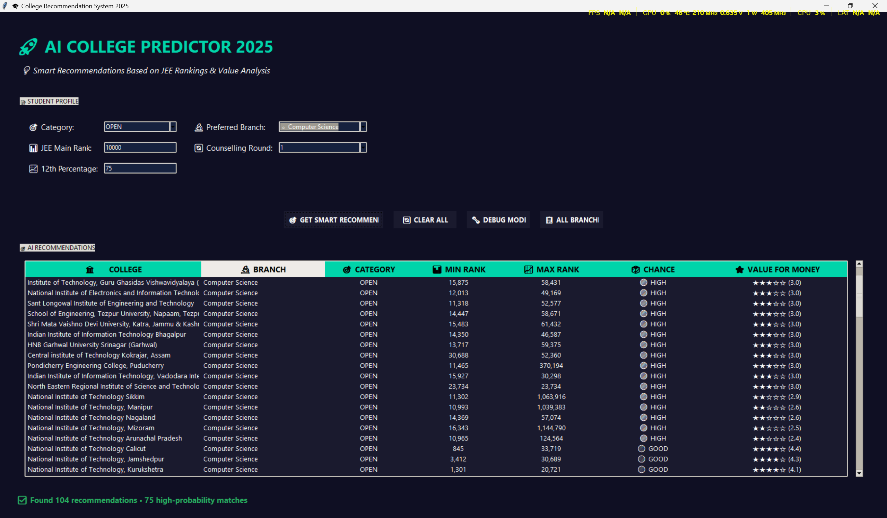
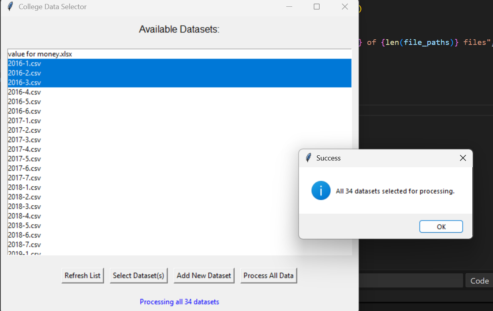

# AI-Powered College Recommendation System for JEE Main Students

A comprehensive machine learning application that analyzes historical admission data and Value for Money (VFM) metrics to provide personalized college and branch recommendations for Indian engineering students.

---

## Features

- Multi-dataset processing for college admission data  
- Fuzzy string matching to handle inconsistencies in college names  
- Branch extraction using regex for 15+ engineering disciplines  
- Dynamic admission probability calculation based on JEE Main rank and category  
- Modern dark-themed Tkinter GUI  
- Value for Money (VFM) score integration with star ratings  
- JSON-based model persistence for easy reuse  

---

## Screenshots

## Screenshots

### Main UI


### Data Set Selector



---

## Installation

1. Clone the repository:
```bash
git clone https://github.com/lokeshpolkam/college-recommendation-system.git
cd college-recommendation-system
