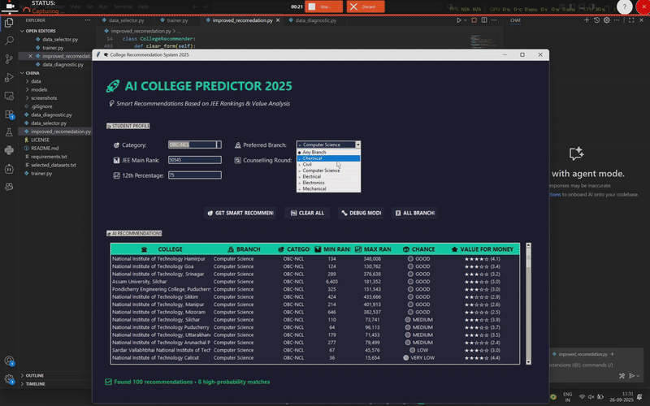

# AI-Powered College Recommendation System for JEE Main Students


---

## Project Overview
This is a sophisticated AI-powered college recommendation system for Indian engineering admissions. It uses JEE Main ranks and Value for Money (VFM) analysis to suggest colleges and branches to students. The project consists of three interconnected Python modules that create a complete data pipeline and user interface.

The system demonstrates advanced Python programming skills including data processing, fuzzy string matching, regex-based branch extraction, machine learning, and GUI development using Tkinter.

---

## Features
- Multi-dataset processing with Excel/CSV files
- Fuzzy matching of college names across datasets
- Branch extraction from program names (15+ engineering disciplines)
- Dynamic admission probability calculation based on JEE rank
- Modern dark-themed GUI with VFM score integration
- Demo GIF to showcase functionality

---

### Main UI


### Data Set Selector


## Demo



---

## Installation

1. Clone the repository:
```bash
git clone https://github.com/lokeshpolkam/college-recommendation-system.git
